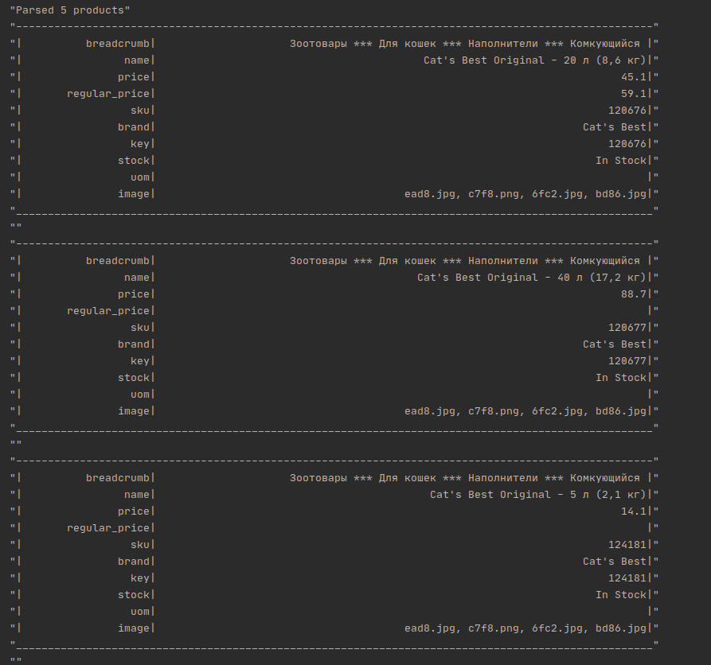

# Заглушка для класса Scripting::BaseNavigation и CustomParser

Пример реализации класса Navigator находится в файле example.rb

Пример реализации класса Parser в файле parser_example.rb

Обратите внимание, что у контекста класса CustomParser есть классный метод print_products :)

